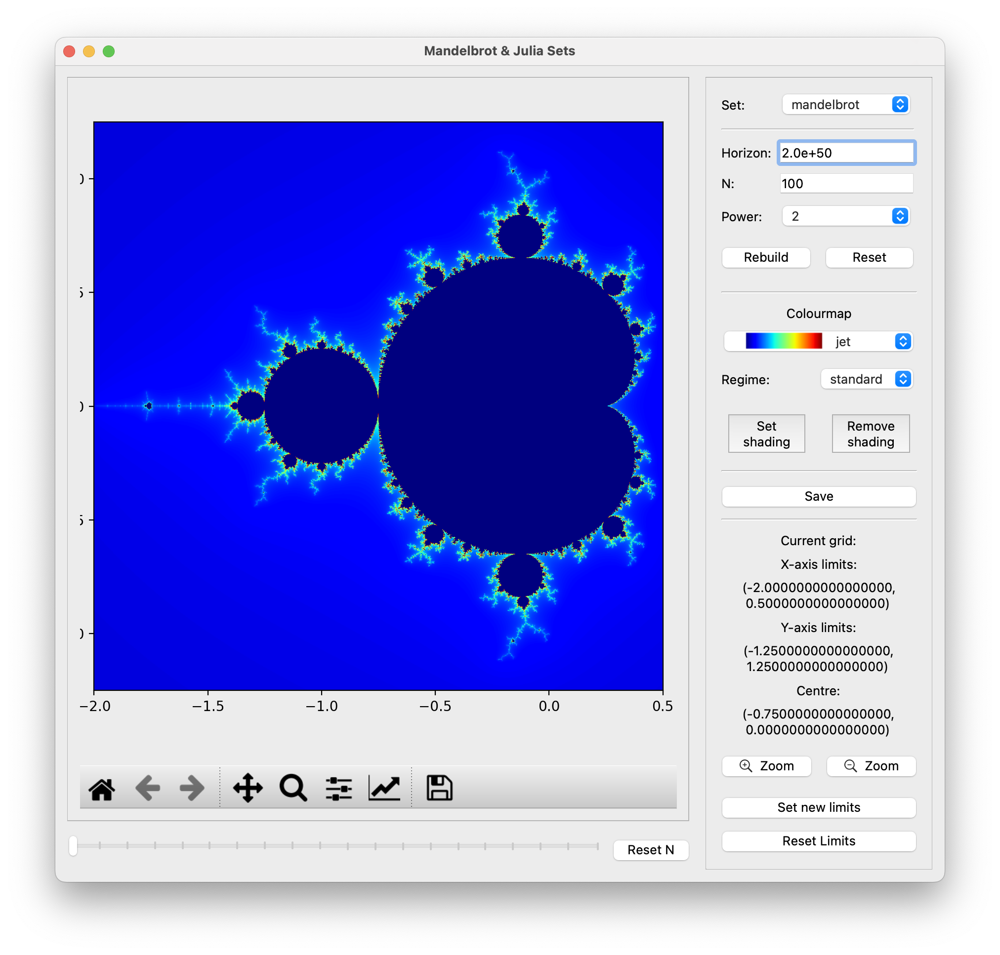
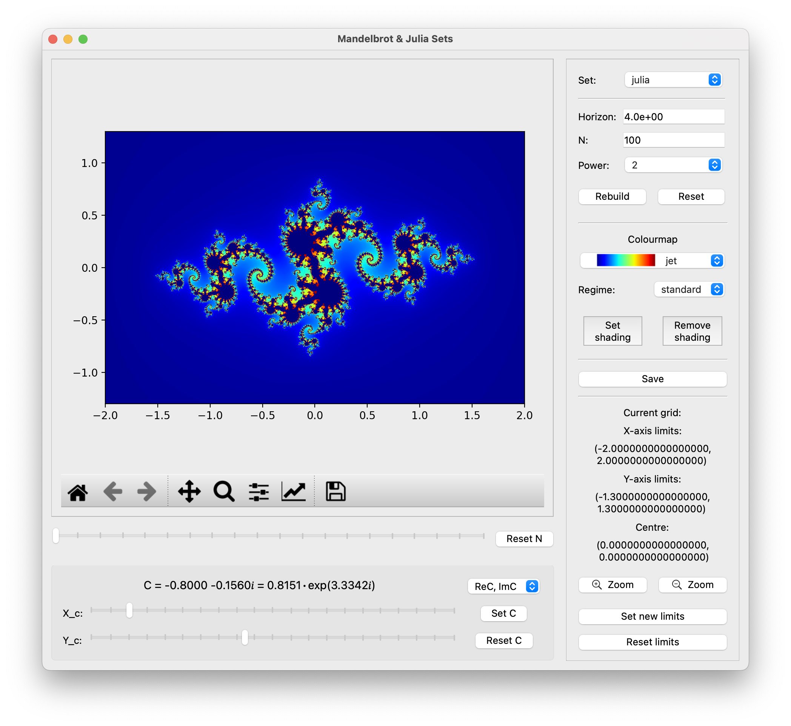
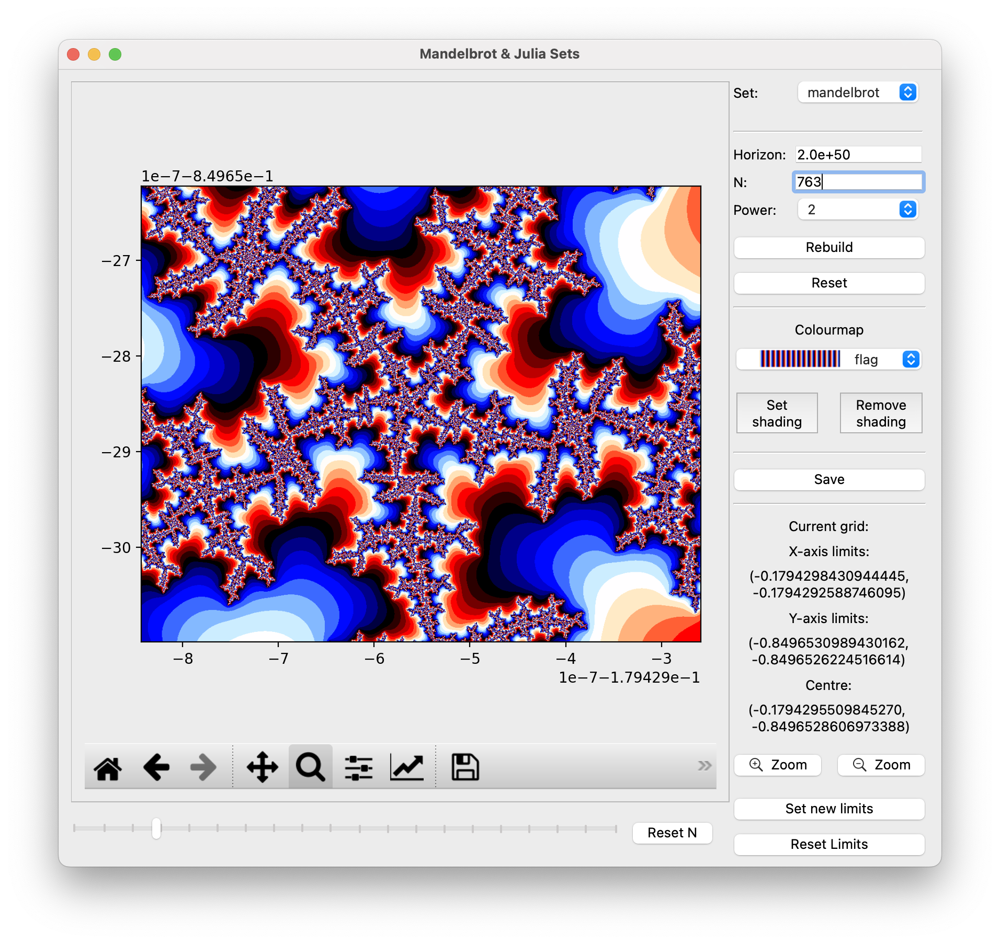
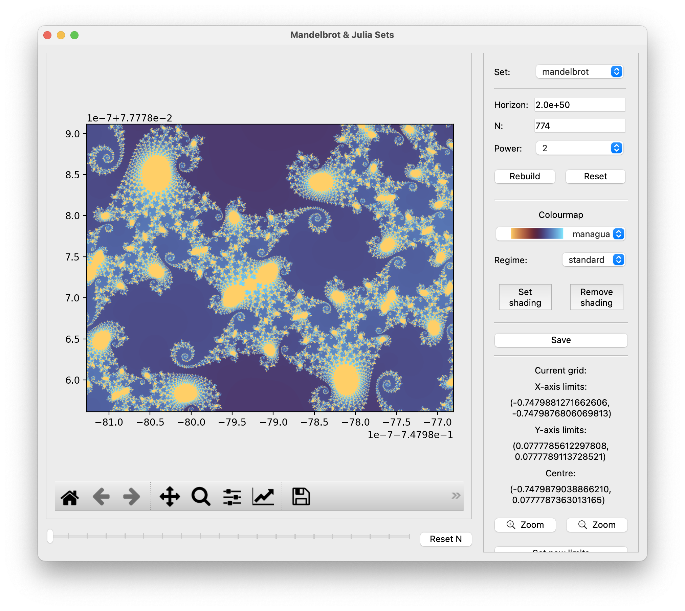
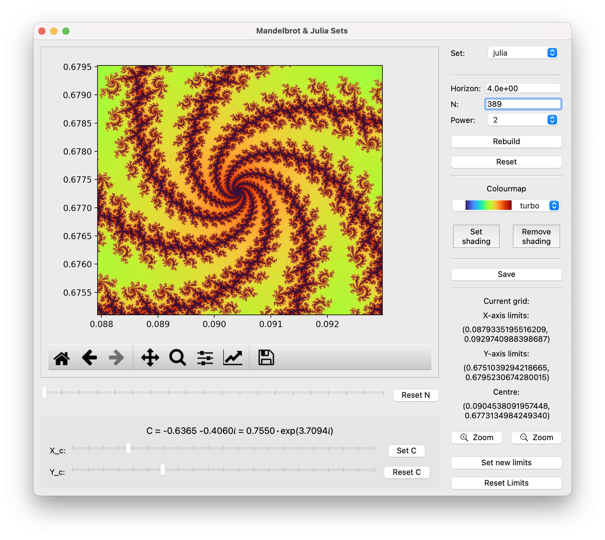
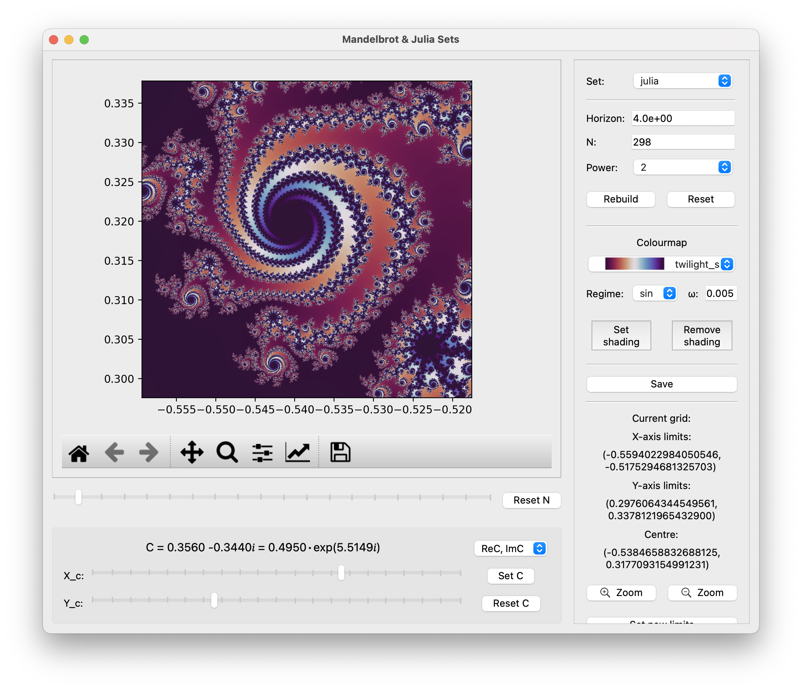
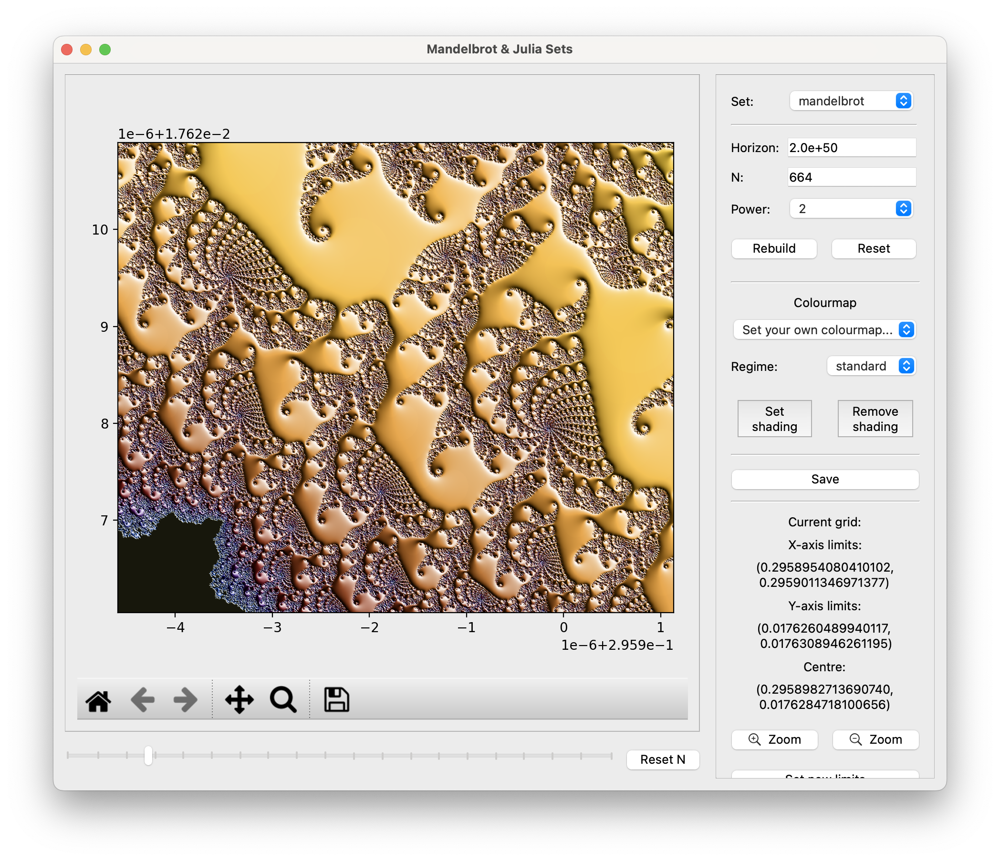
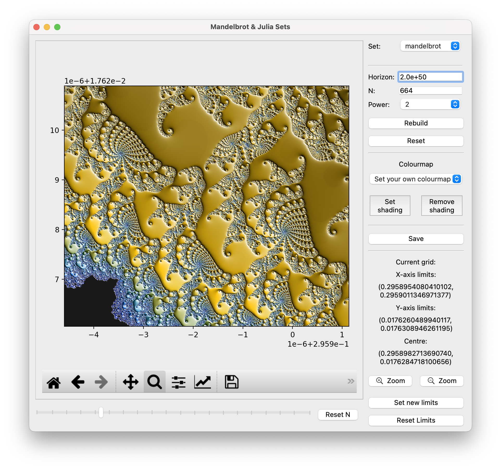

# Mandelbrot & Julia Sets Viewer

Just another one simple PyQt (PySide6) GUI that shows 
beautiful Mandelbrot and Julia fractals, allowing 
user to explore them interactively. The user can zoom 
into different parts of the fractals, adjust calculation 
parameters, customise colours and save the generated images.




## Contents 

* [Installation](#installation)
* [Theory of Mandelbrot and Julia fractals](#theory-of-mandelbrot-and-julia-fractals)
* [Setting the limits and exploring](#setting-the-limits-and-exploring)
  * [Zooming and Navigation](#zooming-and-navigation)
  * [Manual Limit Configuration](#manual-limit-configuration)
* [Adjustable parameters](#adjustable-parameters)
* [Colours and Shading](#colours-and-shading)
* [Saving](#saving)

## Installation

This Application requires Pyside 6.5+ and Python 3.11+. 
The easiest way is to crate the virtual environment and run 
the code through it:

``` shell
python3 -m venv fractal
source fractal/bin/activate
```

Then update pip, install all the required packages and run
the code:

``` shell
pip3 install -r requirements.txt
python3 Interface.py
```

## Theory of Mandelbrot and Julia fractals

Both Mandelbrot and Julia sets are defined in the 
complex plane $\mathbb{C}: z = x + iy$ and are based on 
the iterative sequence:

``` math
z_{n+1} = z_n^k + c.
```

For the **Mandelbrot set**, the sequence starts 
with $z_0 = 0$ and $c = z$. For the **Julia set**, $z_0 = z$ 
and $c = x_c + iy_c$ is a constant chosen by the user.
The most common exponent is $k=2$, but the user can 
choose any integer power from $2$ to $8$.

If, for a given value of $z$ (and $c$ in the case of 
the Julia set), the sequence does not diverge, 
then $z$ is considered to belong to the set. 
For a more detailed description see 
[Wikipedia](https://en.wikipedia.org/wiki/Mandelbrot_set) 
and [Wikipedia](https://en.wikipedia.org/wiki/Julia_set).

Strictly speaking, from a mathematical perspective, 
images of the Mandelbrot and Julia sets should be 
black-and-white — the given point either belongs 
to the set or it does not. To add colour, a common 
approach is used: points near the outer boundary of 
the set are coloured based on the number of iterations 
required to determine that the point does not belong 
to the set (i.e., when the divergence 
criterion $z_n^2>\rm horizon$ is met). The 
threshold value ${\rm horizon}\geq4$ can be set by the 
user. For a given number $z$ (and $c$ in the case of Julia set), 
the sequence is iterated until the divergence criterion is met. 
The function then returns:

``` math
{\rm iter} - \log_k \left(\frac{z_n^2}{\log({\rm horizon})}\right),
```

Where ${\rm iter}$ is the iteration number at which the divergence 
criterion is satisfied. If the criterion is never met, the function 
returns $0$. This method results in smooth colour transitions. 
The maximum number of iterations, $N$, is also a parameter 
and can be set by the user. The deeper the zoom into the set, 
the larger the value of $N$ required.

## Setting the limits and exploring

The application allows user to interactively explore 
different regions of the Mandelbrot and Julia sets by 
adjusting the limits of the complex plane.

### Zooming and Navigation

* Use **mouse selection** to zoom into a rectangular region 
of interest within the fractal display. Click 
the `🔍` button on the matplotlib toolbar under the image 
and drag over the fractal image to define the zoom area.
* The new region will be recalculated and rendered 
based on the current or default parameters 
(horizon, $N$, power, $C$, see below).
* Use the `Zoom` buttons to zoom-in or zoom-out twice.
* The Matplotlib toolbar also includes the `Pan/Move`, 
`🏠` (return to the initial view), `⬅️`, and 
`➡️` (navigate to the previous/next view) buttons 
for moving around the image.
* Zooming deeper into the set reveals more intricate 
structures. As a result, a **higher iteration limit $N$** 
may be required for finer detail. By default, this limit
depends on the zoom level — the deeper the zoom, the larger
the $N$ value.

### Manual Limit Configuration

For precise control, you can set the complex plane 
limits manually:

1. Click the `Set new limits` button to open the 
limit configuration dialogue.
2. Enter the desired bounds:
   * `Xmin, Xmax` and `Ymin, Ymax` — the desired X- and 
   Y-bounds, or
   * `XCentre`, `YCentre`, `deltaX` and `deltaY` — coordinates
   of the centre and the width of the X- and Y-axis.
3. Confirm the values to apply them to the view.

The current X- and Y-limits, as well as the coordinates 
of the centre are displayed above the Zoom buttons.
Use the `Reset Limits` button to restore the default view range. 
It varies depending on the set type and power.

## Adjustable parameters

The GUI provides several options that the user can customise:

* **Set type** — Choose between Mandelbrot and Julia sets.
* **Horizon** — Divergence threshold $\geq4$. Very large for 
Mandelbrot ($\sim 2\cdot 10^{50}$), but small for Julia ($\sim 4$).
* $N$ — **Iteration limit** — The maximum number of iterations per point. 
The deeper you zoom into the set, the larger the value of $N$ required.
This value can be:
  * Entered manually 
  * Adjusted via the `N-slider`
  * Reset to default using the `Reset N` button. The default 
  value of $N$ depends on the zoom level as 
  $N=100\cdot(1 + \lg({\rm zoom}))$.
* **Power** — Degree of the polynomial $k$ ($2 \leq k \leq 8$).

To generate an image with the desired **Horizon**, 
**N** and **Power**, enter the values and click the 
`Rebuild` button. To restore the default values, click 
the `Reset` button.

* $C$ — **Complex constant for Julia set.** This can be 
set in two ways:
  * Clicking the `C-sliders` to adjust the real and imaginary parts
  of $C = x_c + i y_c$. 
  * Clicking the `set C` button, which allows input via: 
    * Real and imaginary parts, or
    * Modulus $\rho$ and argument $\varphi$: $C=\rho e^{i\varphi}$. 

The current value of $C$ is displayed above the C-sliders. 
To return to the default value $C = -0.8 - 0.156i$,
click the `Reset C` button.

## Colours and Shading

The application offers customisable colour schemes 
and shading effects to enhance the visualisation of 
the Mandelbrot and Julia sets:

* **Colourmaps**: Choose from a wide range of matplotlib 
colour palettes via the dropdown menu. Each option 
displays a preview of the colour gradient.
* **Shading**: Click `Set shading` to apply hillshading 
effects. In the configuration dialogue adjust:
  * The light source’s azimuth and altitude. Angles are 
  in degrees, with the azimuth measured clockwise from 
  north and elevation up from the zero plane of the surface.
  * The vertical exaggeration for 3D-like depth. This is 
  the amount to exaggerate the elevation values by 
  when calculating illumination.

For details see the [matplotlib documentation](https://matplotlib.org/stable/api/_as_gen/matplotlib.colors.LightSource.html#) 
and [tutorials](https://matplotlib.org/stable/gallery/showcase/mandelbrot.html).

To revert to the flat colourmap display, click 
the `Remove Shading` button.

## Saving

Generated images can be exported in multiple formats 
for high-quality output by clicking the `Save` button:
* **Supported Formats**: PNG, JPEG, TIFF, PDF, and EPS.
* **Customisation**: Specify dimensions (in inches) and 
dots per inches (DPI) to control resolution and file size.
Toggle `With Axes` to retain coordinate labels and ticks.
Enable `Lock Aspect Ratio` to maintain current proportions
when adjusting width or height. 
The image renders at the specified resolution, preserving 
shading and colourmap preferences.

---

Overall, have fun!
<details>
 <summary><i>Some screenshots:</i></summary>
 
 
 
 
 
 
 
 
</details>
