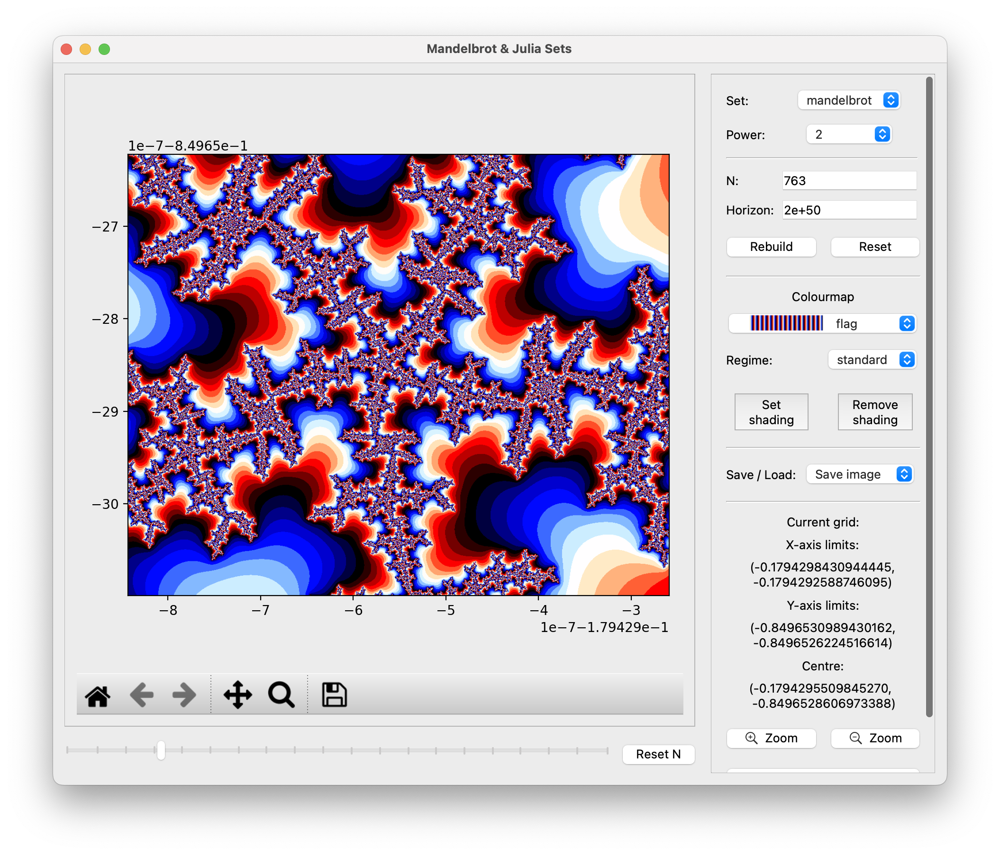
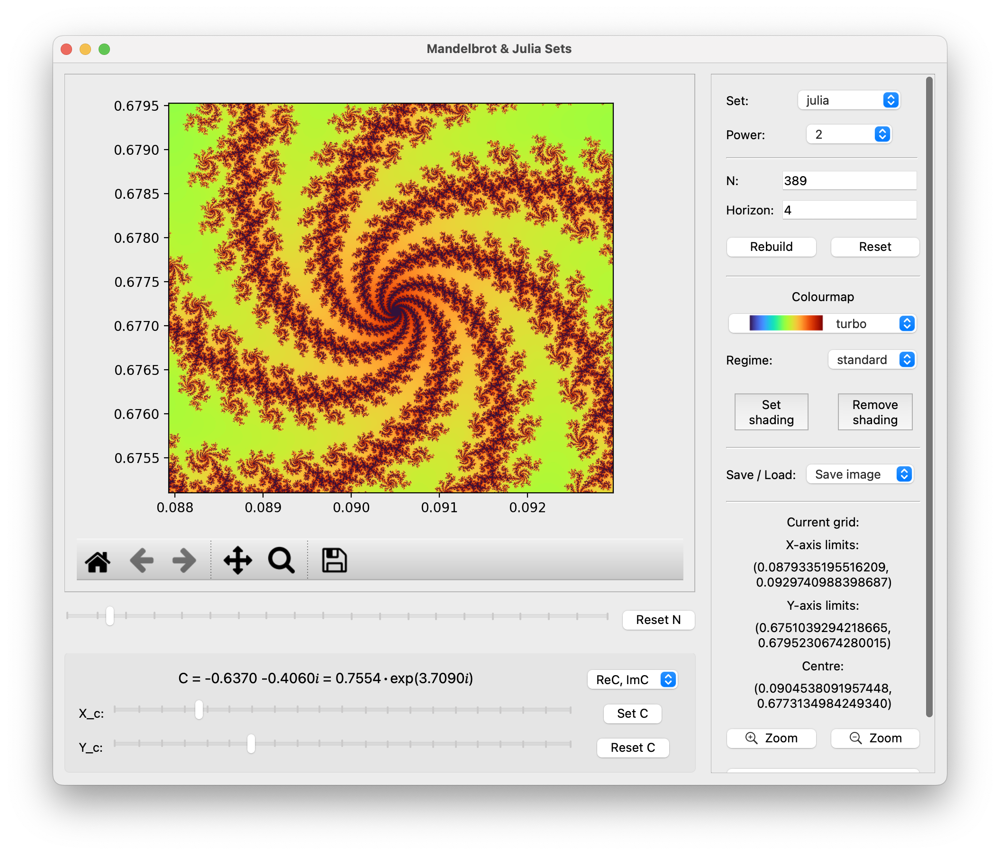
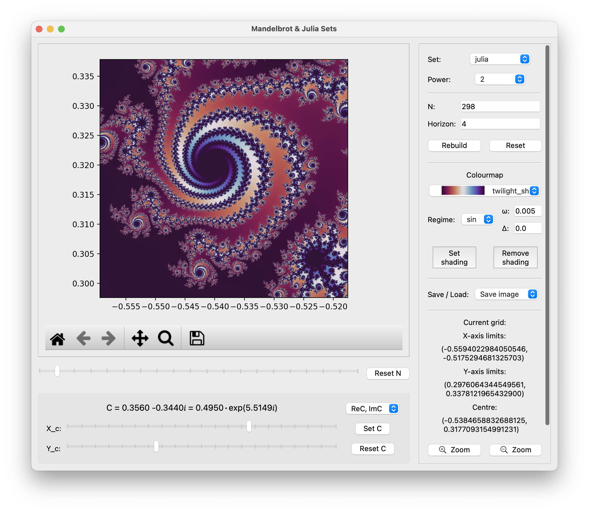
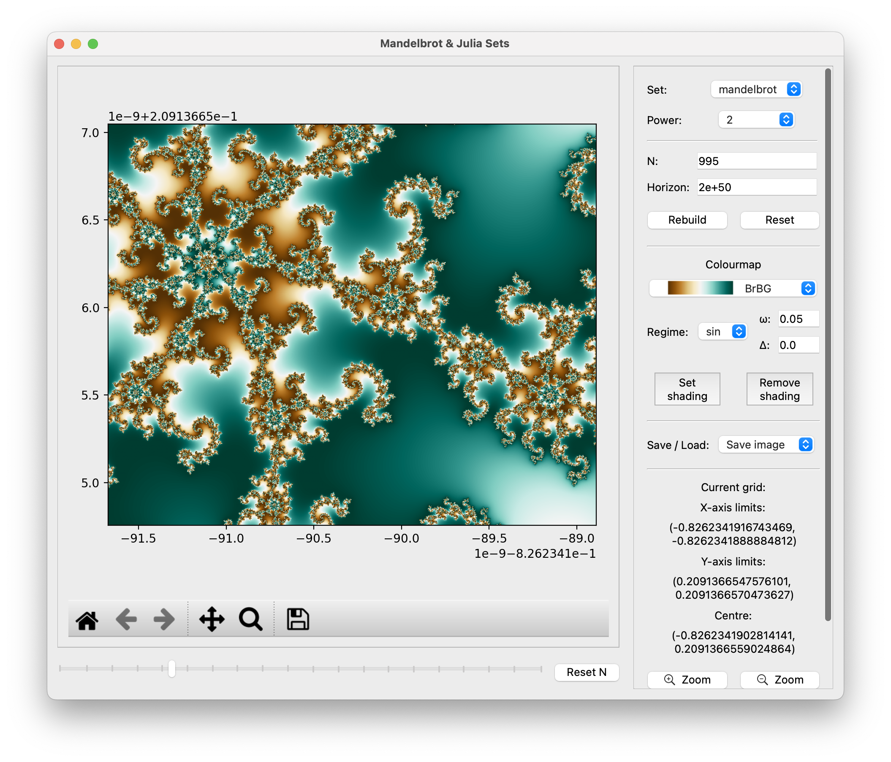

# Mandelbrot & Julia Sets Viewer

Just another one simple PyQt (PySide6) GUI that shows
beautiful Mandelbrot and Julia fractals, allowing
user to explore them interactively. The user can zoom
into different parts of the fractals, adjust calculation
parameters, customise colours and save the generated images.

### Features:

* Interactive visualisation of **Mandelbrot** and **Julia** sets
* Support for arbitrary powers $k$ (from 2 to 8) in defining the sets
* Zooming and panning for detailed exploration
* Customisable calculation parameters
* Various colourmaps, including user-defined ones
* Shading options for enhanced visuals
* Export images to common formats
* Scripts for creating the zoom and rotation animations


## Contents

* [Installation](#installation)
* [Theory of Mandelbrot and Julia fractals](#theory-of-mandelbrot-and-julia-fractals)
* [Setting the limits and exploring](#setting-the-limits-and-exploring)
  * [Zooming and Navigation](#zooming-and-navigation)
  * [Manual Limit Configuration](#manual-limit-configuration)
* [Adjustable parameters](#adjustable-parameters)
* [Colours and Shading](#colours-and-shading)
  * [Colourmaps](#colourmaps)
  * [Colouring regimes](#colouring-regimes)
  * [Shading](#shading)
* [Saving and loading](#saving-and-loading)
* [Animations](#animations)
  * [Zooming](#zooming)
  * [Rotation](#rotation)
* [Gallery](#gallery)

## Installation

This Application requires Pyside 6.5+ and Python 3.11+.
The easiest way is to create the virtual environment and run
the code through it:

``` shell
python3 -m venv fractal
source fractal/bin/activate
```

Then update pip, install all the required packages and run
the code:

``` shell
pip3 install -r requirements.txt
python3 Interface.py
```

## Theory of Mandelbrot and Julia fractals

Both Mandelbrot and Julia sets are defined in the
complex plane $\mathbb{C}: z = x + iy$ and are based on
the iterative sequence:

``` math
z_{n+1} = z_n^k + c.
```

For the **Mandelbrot set**, the sequence starts
with $z_0 = 0$ and $c = z$. For the **Julia set**, $z_0 = z$
and $c = x_c + iy_c$ is a constant chosen by the user.
The most common exponent is $k=2$, but the user can
choose any integer power from $2$ to $8$.

If, for a given value of $z$ (and $c$ in the case of
the Julia set), the sequence does not diverge,
then $z$ is considered to belong to the set.
For a more detailed description see
[Wikipedia](https://en.wikipedia.org/wiki/Mandelbrot_set)
and [Wikipedia](https://en.wikipedia.org/wiki/Julia_set).

Strictly speaking, from a mathematical perspective,
images of the Mandelbrot and Julia sets should be
black-and-white — the given point either belongs
to the set or it does not. To add colour, a common
approach is used: points near the outer boundary of
the set are coloured based on the number of iterations
required to determine that the point does not belong
to the set (i.e., when the divergence
criterion $z_n^2>\rm horizon$ is met). The
threshold value ${\rm horizon}\geq4$ can be set by the
user. For a given number $z$ (and $c$ in the case of Julia set),
the sequence is iterated until the divergence criterion is met.
The function then returns:

``` math
{\rm iter} - \log_k \left(\frac{\ln(z_n^2)}{\ln({\rm horizon})}\right),
```

Where ${\rm iter}$ is the iteration number at which the divergence
criterion is satisfied. If the criterion is never met, the function
returns $0$. This method results in smooth colour transitions.
The maximum number of iterations, $N$, is also a parameter
and can be set by the user. The deeper the zoom into the set,
the larger the value of $N$ required.

## Setting the limits and exploring

The application allows user to interactively explore
different regions of the Mandelbrot and Julia sets by
adjusting the limits of the complex plane.

### Zooming and Navigation

* Use **mouse selection** to zoom into a rectangular region
of interest within the fractal display. Click
the `🔍` button on the matplotlib toolbar under the image
and drag over the fractal image to define the zoom area.
* The new region will be recalculated and rendered
based on the current or default parameters
(horizon, $N$, power, $C$, see below).
* Use the `Zoom` buttons to zoom-in or zoom-out twice.
* The Matplotlib toolbar also includes the `Pan/Move`,
`🏠` (return to the initial view), `⬅️`, and
`➡️` (navigate to the previous/next view) buttons
for moving around the image.
* Zooming deeper into the set reveals more intricate
structures. As a result, a **higher iteration limit $N$**
may be required for finer detail. By default, this limit
depends on the zoom level — the deeper the zoom, the larger
the $N$ value.

### Manual Limit Configuration

For precise control, you can set the complex plane
limits manually:

1. Click the `Set new limits` button to open the
limit configuration dialogue.
2. Enter the desired bounds:
   * `Xmin, Xmax` and `Ymin, Ymax` — the desired X- and
   Y-bounds, or
   * `XCentre`, `YCentre`, `deltaX` and `deltaY` — coordinates
   of the centre and the width of the X- and Y-axis.
3. Confirm the values to apply them to the view.

The current X- and Y-limits, as well as the coordinates
of the centre are displayed above the Zoom buttons.
Use the `Reset limits` button to restore the default view range.
It varies depending on the set type and power.

## Adjustable parameters

The GUI provides several options that the user can customise:

* **Set type** — Choose between Mandelbrot and Julia sets.
* **Horizon** — Divergence threshold $\geq4$. Very large for
Mandelbrot ($\sim 2\cdot 10^{50}$), but small for Julia ($\sim 4$).
* $N$ — **Iteration limit** — The maximum number of iterations per point.
The deeper you zoom into the set, the larger the value of $N$ required.
This value can be:
  * Entered manually
  * Adjusted via the `N-slider`
  * Reset to default using the `Reset N` button. The default
  value of $N$ depends on the zoom level as
  $N=100\cdot(1 + \lg({\rm zoom}))$.
* **Power** — Degree of the polynomial $k$ ($2 \leq k \leq 8$).
Mandelbrot sets shift when the power is changed, so use the
`Reset limits` button to re-centre the set.

To generate an image with the desired **Horizon**,
**N** and **Power**, enter the values and click the
`Rebuild` button. To restore the default values, click
the `Reset` button.

* $C$ — **Complex constant for Julia set.** This can be
set in two ways:
  * By adjusting the `C-sliders` to modify either the real and
  imaginary parts of $C = x_c + i y_c$, or the modulus $\rho$
  and argument $\varphi$: $C=\rho e^{i\varphi}$. The relevant
  option — `ReC, ImC` or `$\rho$, $\varphi$` — is selected via
  the corresponding dropdown menu.
  * Clicking the `set C` button, which allows input via:
    * Real and imaginary parts, or
    * Modulus and argument.

The current value of $C$ is displayed above the C-sliders.
To return to the default value $C = -0.8 - 0.156i$,
click the `Reset C` button.

## Colours and Shading

The application offers customisable colour schemes
and shading effects to enhance the visualisation of
the Mandelbrot and Julia sets:

### Colourmaps

Choose from a wide range of [matplotlib
colour palettes](https://matplotlib.org/stable/users/explain/colors/colormaps.html)
via the dropdown menu. Each option displays a preview
of the colour gradient.

* **User-defined colourmaps**: By selecting the
`Set your own colourmap...` option from the dropdown menu,
you can create your own colourmap by placing colour points
along the gradient. You can also save the created colourmap
to a file and load previously saved colourmaps to edit or use them.

### Colouring regimes

There are two colouring techniques available in the
`Regime` dropdown menu:

* `Standard`: Applies linear colour scaling, mapping the
lowest data value to 0 and the highest to 1.
* `Sin`: Transforms the data using the formula
$\sin^2(\omega \cdot \text{data})$,
where the frequency $\omega$ (default: $0.01$) can be set
by the user. This allows for cyclic colour variation.

### Shading

Click `Set shading` to apply hillshading
effects. In the configuration dialogue adjust:

* The light source’s azimuth and altitude. Angles are
  in degrees, with the azimuth measured clockwise from
  north and elevation up from the zero plane of the surface.
* The vertical exaggeration for 3D-like depth. This is
  the amount to exaggerate the elevation values by
  when calculating illumination.

For details see the [matplotlib documentation](https://matplotlib.org/stable/api/_as_gen/matplotlib.colors.LightSource.html#)
and [tutorials](https://matplotlib.org/stable/gallery/showcase/mandelbrot.html).
To revert to the flat colourmap display, click
the `Remove shading` button.

## Saving and loading

`Save / Load` dropdown menu allows you to save images,
as well as to save and load metadata.

**Generated images** can be exported in multiple formats
for high-quality output by choosing the `Save image` option
or clicking the `💾` icon on the matplotlib toolbar
under the image:

* **Supported Formats**: PNG, JPEG, TIFF, PDF, and EPS.
* **Customisation**: Specify dimensions (in inches) to
control resolution and file size.
Enable `Lock Aspect Ratio` to maintain the current
proportions when adjusting the width or height.
Toggle `With Axes` to retain coordinate labels and ticks.
In that case, you can also set the dots per inches (DPI) of
the image, which will affect the size of the axes — see
[here](https://stackoverflow.com/a/47639545) for a
discussion on DPI.
The image renders at the specified resolution, preserving
shading and colourmap preferences.

**Metadata** refers to a JSON file that contains all the
information about the generated fractal  — set type,
calculation parameters, axis limits, and colouring/shading
options. By selecting the `Save metadata` option, you can
save the current fractal for quick access in the future.
To load a previously saved fractal, choose the
`Load metadata` option.

## Animations

Both the zoom and rotation scripts require the `opencv-python`
package to be installed:

``` shell
pip3 install opencv-python
```

### Zooming

The script `zoom_animation.py` generates a smooth zoom animation
of a fractal — either the Mandelbrot set or a Julia set. It supports
numerous customisation options, which are described via the `--help` flag:

``` shell
python3 zoom_animation.py --help
usage: zoom_animation.py [-h] [--metadata METADATA] [--x_centre_1 X_CENTRE_1]
                         [--y_centre_1 Y_CENTRE_1] [--delta_x_1 DELTA_X_1]
                         [--delta_y_1 DELTA_Y_1] [--x_centre_2 X_CENTRE_2]
                         [--y_centre_2 Y_CENTRE_2] [--delta_x_2 DELTA_X_2]
                         [--delta_y_2 DELTA_Y_2] [--x_c X_C] [--y_c Y_C]
                         [-m {mandelbrot,julia}] [-p {2,3,4,5,6,7,8}]
                         [-H HORIZON] [-f FRAMES] [-l LENGTH] [-hei HEIGHT]
                         [-c COLOURMAP] [-r {standard,sin}] [-fr FREQ] [-s]
                         [-az AZDEG] [-al ALTDEG] [-ve VERT_EXAG] [-t THREADS]
...description...
```

The primary input parameters are the coordinates of the centres of
the initial and final fractals, along with the widths of the
X- and Y-axes for both views. Alternatively, you may provide
a previously saved `metadata.json` file to set the final
fractal's coordinates and other calculation and colouring options.
You can also use a previously saved `colourmap.json` file
to set the custom colourmap.

**Note**: The aspect ratios of the initial and final frames
should match. You can ensure this by adjusting the axis widths
and the image's length and height accordingly. If the aspect
ratios differ, the script will suggest possible corrections,
but can still generate a video using the current aspect ratio.

Below is an example video created with the default values for all flags:

``` shell
python3 zoom_animation.py
```

The video has been compressed for README:

<https://github.com/user-attachments/assets/b6f3584d-e586-4d01-9979-5343ae6c0b84>

## Rotation

The script `rotate_animation.py` generates a smooth rotational animation
of a Julia set, in which the angle (argument $\varphi$) of the complex
parameter $C=\rho e^{\varphi}$ varies over time, tracing a circular
path in the complex plane. The result is a visually striking
transformation of the Julia set as it rotates through the parameter space.
It supports numerous customisation options, which are described
via the `--help` flag:

``` shell
python3 rotate_animation.py --help
usage: rotate_animation.py [-h] [--metadata METADATA] [--xmin XMIN]
                           [--xmax XMAX] [--ymin YMIN] [--ymax YMAX]
                           [--rho RHO] [--phi_min PHI_MIN] [--phi_max PHI_MAX]
                           [--n N] [-p {2,3,4,5,6,7,8}] [-H HORIZON]
                           [-f FRAMES] [-l LENGTH] [-hei HEIGHT]
                           [-c COLOURMAP] [-r {standard,sin}] [-fr FREQ] [-s]
                           [-az AZDEG] [-al ALTDEG] [-ve VERT_EXAG]
                           [-t THREADS]
...description...
```

The primary input parameters are the bounds of the X- and Y-axes,
the modulus $\rho$ of the Julia set C-parameter, and the minimum
and maximum values of the argument $\varphi$.
Alternatively, you may provide a previously saved `metadata.json`
file to set the fractal's coordinates and other calculation and
colouring options. You can also use a previously
saved `colourmap.json` file to set the custom colourmap.

**Note**: The aspect ratio of the axes and image size
should match. You can ensure this by adjusting the axis widths
and the image's length and height accordingly. If the aspect
ratios differ, the script will suggest possible corrections,
but can still generate a video using the current aspect ratio.

Below is an example video created using the following flag:

``` shell
python3 rotate_animation.py --power 3 --xmin -1.5 --xmax 1.5 --ymin -1.5 --ymax 1.5
```

The video has been compressed for README:

<https://github.com/user-attachments/assets/8c3fb3a6-dcdc-4c38-8dbc-e173b8110aeb>

## Gallery

Overall, have fun! Some screenshots with
corresponding **metadata**:

[First](im_met_col/Metadata_3.json):

[Second](im_met_col/Metadata_4.json):

[Third](im_met_col/Metadata_5.json):

`Sin` colourisation results in beautifully cycling colours.
The $\omega$ parameter controls how frequently the
colours cycle ([Metadata](im_met_col/Metadata_6.json)):

[Fifth](im_met_col/Metadata_7.json):

Shading option (`vert_exag=3.0`) with
[custom colourmap](im_met_col/Colourmap.json) ([Metadata](im_met_col/Metadata_8.json)):

[Seventh](im_met_col/Metadata_9.json):

`Sin` colourisation and shading (`vert_exag=100.0`, [Metadata](im_met_col/Metadata_10.json)):

